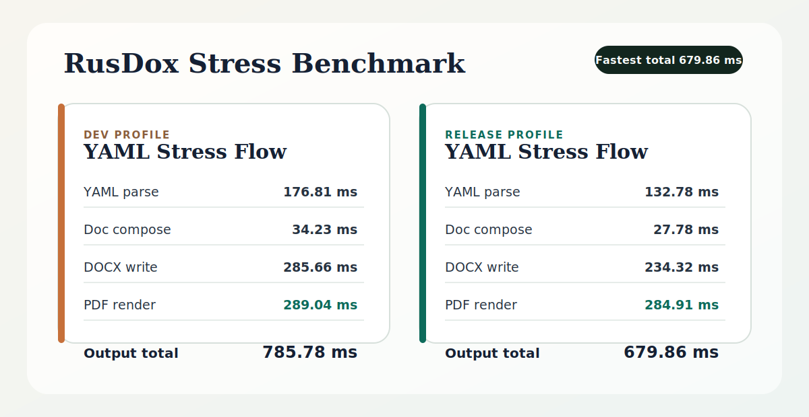

# RusDox


Generate massive DOCX and PDF files at Rust speed.

RusDox is not just another YAML-to-document helper. It is a pure Rust document engine built for generating `.docx` and `.pdf` files programmatically, fast enough for serious automation.

If you have ever tried to create Word or PDF files in code, you already know the usual failure modes:

- slow office runtimes
- brittle conversions
- poor control over layout
- painful scaling when documents get large

RusDox keeps authoring simple with YAML and keeps the rendering path in Rust. The latest 1000-page stress run renders both DOCX and PDF in `679.86 ms` in release mode.

## Why It Lands

- Generate a 1000-page DOCX and PDF pair in under a second in release mode.
- Create large files without Word, LibreOffice, or an external office runtime.
- Keep authoring readable with YAML while the heavy lifting stays in Rust.
- Validate specs before render so semantic issues fail early in CI and local workflows.
- Rebuild documents automatically while editing specs or config files.
- Benchmark real parse, validation, compose, DOCX, and PDF timings from the CLI.
- Keep simple authoring in YAML longer with variables, includes, and repeaters.
- Set document metadata such as title, author, subject, keywords, and custom properties directly from specs or Rust.
- Use one tool for recurring reports, invoices, proposals, dashboards, and batch document jobs.

## Real-World Use Cases

- Executive and board reporting: recurring operating packs, KPI dashboards, and leadership reviews
- Client-facing automation: proposals, invoices, onboarding packs, and launch briefs
- Internal document infrastructure: batch exports, meeting notes, project briefs, and template-driven pipelines

## Benchmark Proof



Latest 1000-page YAML stress run:

- Generator: `./scripts/generate_stress_yaml.sh`
- Dev: `./scripts/run_stress_yaml.sh`
- Dev timings: `176.81 ms` parse, `34.23 ms` compose, `285.66 ms` DOCX, `289.04 ms` PDF, `785.78 ms` total
- Release: `./scripts/run_stress_yaml.sh --release`
- Release timings: `132.78 ms` parse, `27.78 ms` compose, `234.32 ms` DOCX, `284.91 ms` PDF, `679.86 ms` total

That is the real value proposition: RusDox is for generating very large Word and PDF files programmatically without the usual office stack overhead.

## First Demo

Install the CLI:

```bash
curl -fsSL https://raw.githubusercontent.com/OthmaneBlial/rusdox/main/scripts/install.sh | sh
```

Create a starter doc:

```bash
mkdir my-rusdox-docs
cd my-rusdox-docs
rusdox init-doc mydoc.yaml
```

Edit `mydoc.yaml`:

```yaml
output_name: client-brief
blocks:
  - type: title
    text: Client Brief
  - type: subtitle
    text: Q2 rollout
  - type: section
    text: Summary
  - type: body
    text: Launch is approved pending final security FAQ wording.
  - type: bullets
    items:
      - Pricing is approved.
      - Support macros are in review.
      - Commercial release is planned for April 7.
```

Generate the files:

```bash
rusdox mydoc.yaml
```

You get:

- `generated/client-brief.docx`
- `rendered/client-brief.pdf`

Render a whole folder of YAML docs:

```bash
rusdox examples
```

Validate before rendering:

```bash
rusdox validate mydoc.yaml
rusdox validate examples --format json
```

Watch a spec while editing:

```bash
rusdox watch mydoc.yaml
```

Benchmark a render path:

```bash
rusdox bench examples/stress/stress_1000_pages.yaml --iterations 5 --warmup 1
```

## What Makes It Different

- Pure Rust `.docx` generation
- Pure Rust PDF rendering
- No Word dependency
- No LibreOffice dependency
- Human-readable YAML examples
- Config-driven styling through `rusdox.toml`
- Reusable named paragraph, run, and table styles with inheritance
- YAML composition features for variables, includes, and repeaters
- First-class document metadata in specs and the Rust API
- First-class `validate`, `watch`, and `bench` CLI workflows

## Examples

`examples/` is now a folder of YAML document specs.

Highlights:

- `examples/board_report.yaml`
- `examples/executive_dashboard.yaml`
- `examples/product_launch_brief.yaml`
- `examples/talent_profile.yaml`
- `examples/formatting_showcase.yaml`
- `examples/named_styles_showcase.yaml`
- `examples/visual_assets_showcase.yaml`
- `examples/yaml_composition_showcase.yaml`
- `examples/stress/stress_1000_pages.yaml`

More detail is in [examples/README.md](examples/README.md).

## Template Gallery


Browse the gallery:

- [docs/gallery.md](docs/gallery.md)
- [examples/board_report.yaml](examples/board_report.yaml)
- [examples/executive_dashboard.yaml](examples/executive_dashboard.yaml)
- [examples/product_launch_brief.yaml](examples/product_launch_brief.yaml)
- [examples/talent_profile.yaml](examples/talent_profile.yaml)

## Docs

The full documentation lives in [`docs/`](docs/README.md).

Start here:

- [docs/README.md](docs/README.md)
- [docs/getting-started.md](docs/getting-started.md)
- [docs/yaml-guide.md](docs/yaml-guide.md)
- [docs/configuration.md](docs/configuration.md)
- [docs/cli.md](docs/cli.md)
- [docs/gallery.md](docs/gallery.md)
- [docs/rust-api.md](docs/rust-api.md)
- [docs/github-setup.md](docs/github-setup.md)

## Configuration

The easiest way to tweak styling is the CLI wizard, not manual TOML editing:

```bash
rusdox config path
rusdox config wizard --level basic
rusdox config wizard --level advanced
```

The install script creates a user config at `~/rusdox/config.toml` when it does not exist yet.

Use it to control:

- fonts
- spacing
- colors
- table defaults
- output folders
- PDF preview behavior

If you want settings only for one project, create a local override:

```bash
rusdox config wizard --path ./rusdox.toml --level basic
```

Load order is:

- `./rusdox.toml`
- `~/rusdox/config.toml`
- built-in defaults

The goal is simple:

- content lives in YAML
- styling lives in config
- speed lives in Rust

## Advanced

If you need full control, dynamic generation, or lower-level document work, RusDox still exposes the Rust API.

See [docs/rust-api.md](docs/rust-api.md). The full docs index is in [docs/README.md](docs/README.md).

That doc covers:

- `cargo add rusdox`
- direct Rust document construction
- config-driven `Studio` usage
- legacy `.rs` script execution
- low-level API notes

## Community

If you want to contribute or report something:

- [CONTRIBUTING.md](CONTRIBUTING.md)
- [CODE_OF_CONDUCT.md](CODE_OF_CONDUCT.md)
- [SECURITY.md](SECURITY.md)
- [SUPPORT.md](SUPPORT.md)

## Status

The current foundation focuses on fast, typed support for:

- paragraphs
- runs and common text formatting
- tables, rows, and cells
- named paragraph, run, and table styles with inheritance
- image, logo, signature, and SVG/chart blocks
- plain-text extraction
- config-driven composition
- YAML/JSON/TOML document specs

Deferred areas include comments, tracked changes, richer metadata, and broader table-style coverage.

## Development

```bash
cargo fmt
cargo clippy --all-targets --all-features -- -D warnings
cargo test
```
