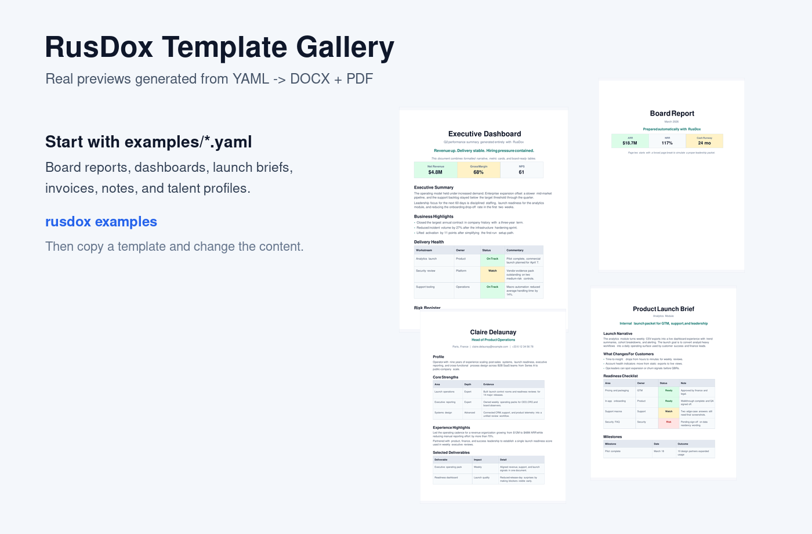
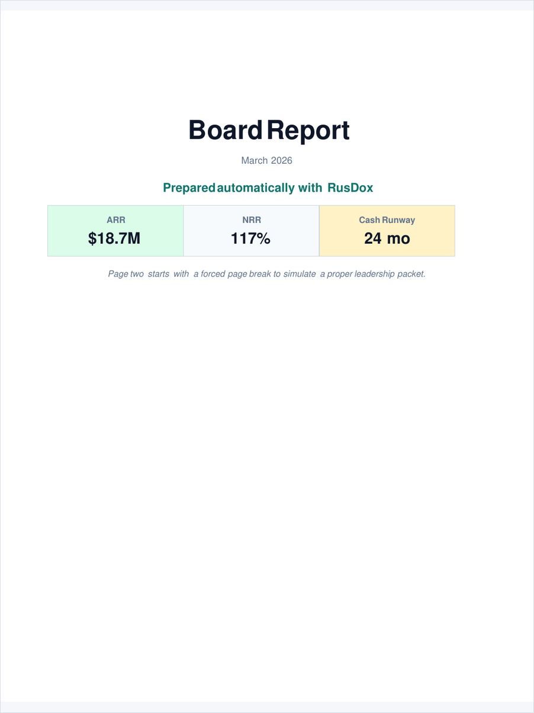
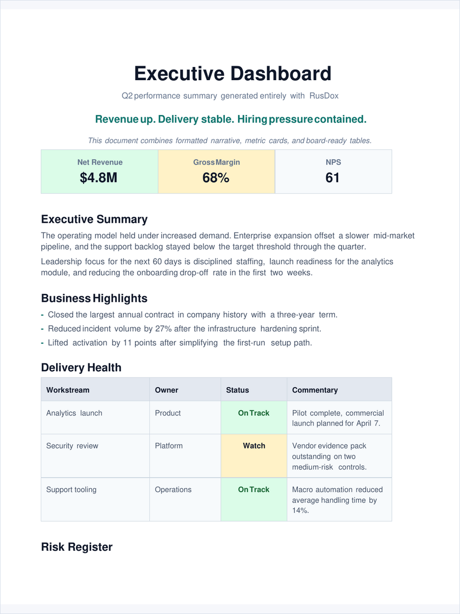
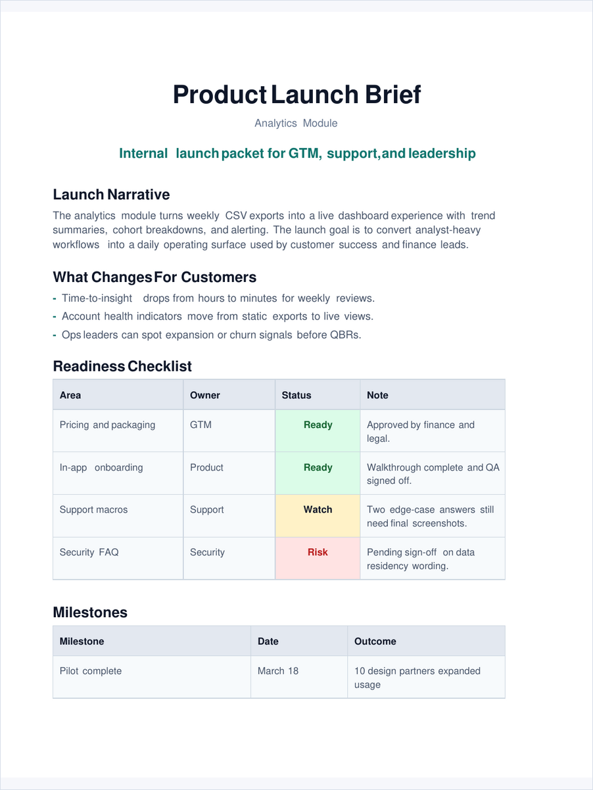
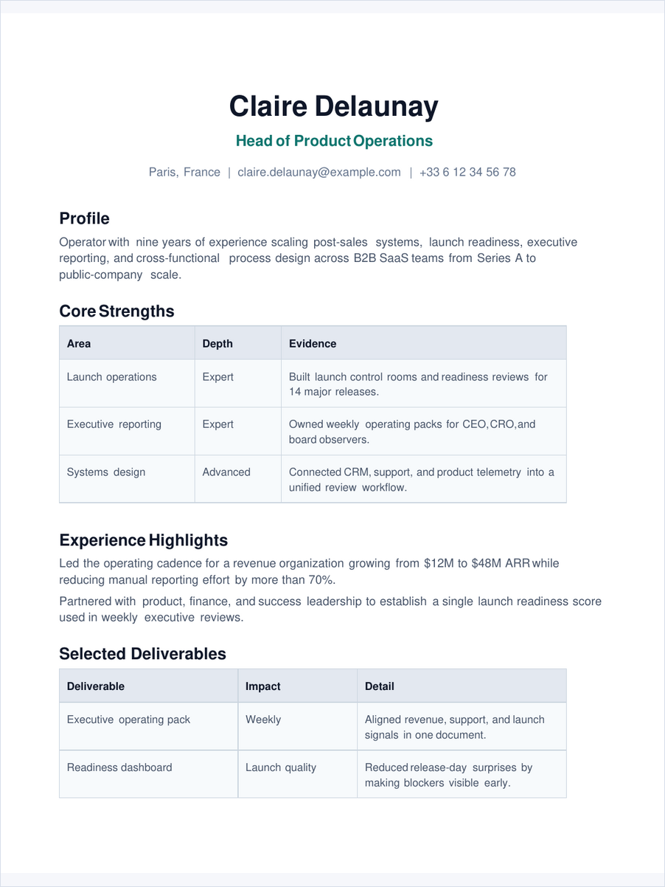
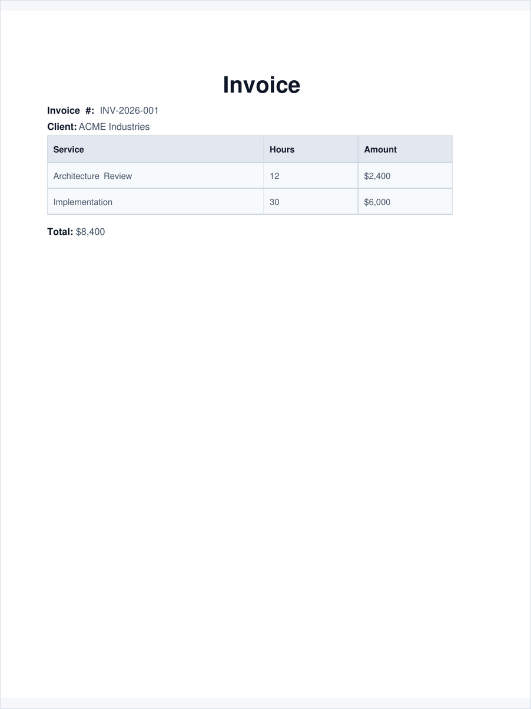
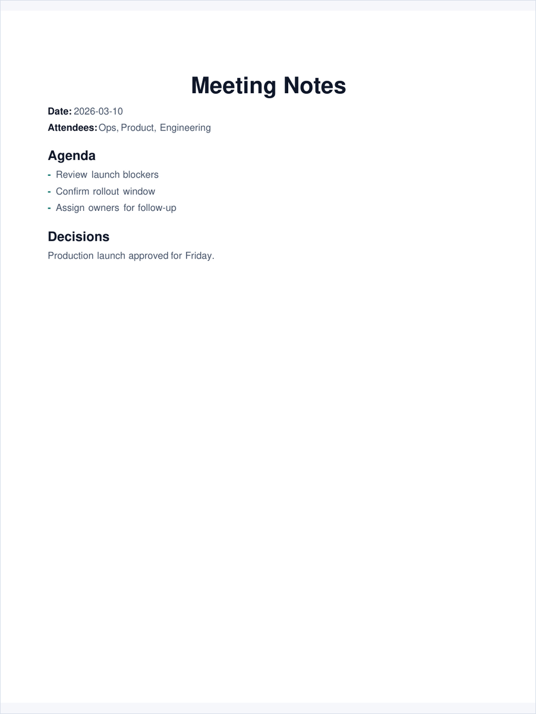

# Template Gallery

These previews are generated from the real PDF outputs in `rendered/`.

That means the gallery shows actual RusDox output, not mockups.



## Board Report



- Spec: [../examples/board_report.yaml](../examples/board_report.yaml)
- Output: board-style packet with cover page, metrics, and scorecard tables

## Executive Dashboard



- Spec: [../examples/executive_dashboard.yaml](../examples/executive_dashboard.yaml)
- Output: dashboard-style summary with metrics and status tables

## Product Launch Brief



- Spec: [../examples/product_launch_brief.yaml](../examples/product_launch_brief.yaml)
- Output: launch narrative with milestones and readiness checks

## Talent Profile



- Spec: [../examples/talent_profile.yaml](../examples/talent_profile.yaml)
- Output: profile or resume-style document

## Invoice



- Spec: [../examples/invoice.yaml](../examples/invoice.yaml)
- Output: invoice layout with line items and totals

## Meeting Notes



- Spec: [../examples/meeting_notes.yaml](../examples/meeting_notes.yaml)
- Output: compact notes with metadata, agenda, and decisions

## Regenerate Gallery Assets

```bash
./scripts/generate_gallery_assets.sh
```
